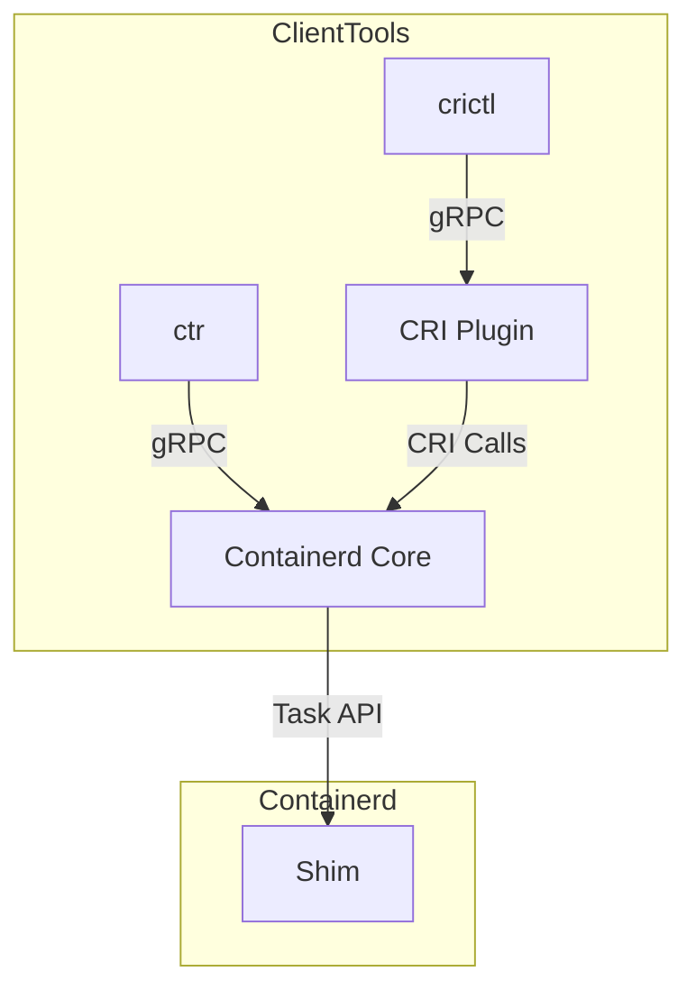

Here’s a step-by-step guide to understanding **gRPC in containerd**, covering architecture, key endpoints, and debugging techniques:

---

### **1. gRPC Architecture Overview**
Containerd exposes two primary gRPC interfaces:
1. **Core gRPC Services**: Tasks, Content, Snapshots, etc. (default port: `127.0.0.1:1338`).  
2. **CRI Plugin gRPC**: Kubernetes-specific API (default socket: `/run/containerd/containerd.sock`).  



---

### **2. Key gRPC Services & Code Locations**
| Service | Protobuf Definition | Implementation | Description |
|---------|---------------------|----------------|-------------|
| **TaskService** | `api/services/tasks/v1/tasks.proto` | `services/tasks/service.go` | Manages container lifecycle (start/stop/tasks). |
| **ContentService** | `api/services/content/v1/content.proto` | `services/content/service.go` | Handles image/artifact storage. |
| **CRI (RuntimeService)** | `pkg/cri/api/v1/api.proto` | `pkg/cri/server/server.go` | Kubernetes CRI interface. |

---

### **3. Step-by-Step: Tracing a gRPC Call (Example: `CreateContainer`)**
#### **1. CRI Plugin Receives gRPC Request**
- **Entrypoint**: `pkg/cri/server/container_create.go`  
  ```go
  func (c *criService) CreateContainer(ctx context.Context, r *runtime.CreateContainerRequest) {
      // 1. Validate request
      // 2. Call containerd's core gRPC services...
  }
  ```

#### **2. Delegates to Core TaskService**
- **Task Creation**:  
  ```go
  container, err := c.client.NewContainer(ctx, id, opts...)
  task, err := container.NewTask(ctx, cio.NewCreator(cio.WithStreams(...)))
  ```
  - **gRPC Flow**: `CRI Plugin → containerd.TaskService → shim`.

#### **3. gRPC Payload Inspection**
- **Protobuf Structure**: See `api/services/tasks/v1/tasks.proto`:
  ```protobuf
  message CreateTaskRequest {
      string container_id = 1;
      bytes runtime = 2; // OCI runtime config
  }
  ```

---

### **4. Debugging gRPC in Containerd**
#### **Method 1: gRPC CLI (`grpcurl`)**
```bash
# List all services
grpcurl -plaintext unix:///run/containerd/containerd.sock list

# Inspect TaskService
grpcurl -plaintext unix:///run/containerd/containerd.sock describe containerd.services.tasks.v1.TaskService

# Call GetTask
grpcurl -plaintext -d '{"container_id": "abc123"}' \
  unix:///run/containerd/containerd.sock \
  containerd.services.tasks.v1.TaskService.Get
```

#### **Method 2: Enable gRPC Debug Logs**
Edit `config.toml`:
```toml
[debug]
  level = "debug"
[grpc]
  address = "/run/containerd/containerd.sock"
```
Then monitor logs:
```bash
sudo journalctl -u containerd -f | grep "transport: http2Server"
```

#### **Method 3: Capture gRPC Traffic**
```bash
# Use socat to expose Unix socket as TCP
socat -v TCP-LISTEN:1339,reuseaddr,fork UNIX-CLIENT:/run/containerd/containerd.sock

# Trace with Wireshark
tshark -i lo -f "tcp port 1339"
```

---

### **5. Key gRPC Endpoints**
| Endpoint | Description | Example Command |
|----------|-------------|-----------------|
| **`/containerd.services.tasks.v1.TaskService/Create`** | Create a container task | `grpcurl -d '{"container_id":"foo"}' ...TaskService/Create` |
| **`/runtime.v1.RuntimeService/RunPodSandbox`** | CRI sandbox creation | `grpcurl -d '{"config":{}}' ...RuntimeService/RunPodSandbox` |
| **`/containerd.services.content.v1.ContentService/List`** | List stored content | `grpcurl ...ContentService/List` |

---

### **6. Common gRPC Issues & Fixes**
1. **"Transport: authentication handshake failed"**  
   - Cause: Mismatched containerd/client versions.  
   - Fix: Use matching versions or rebuild protobufs.  

2. **"Endpoint already in use"**  
   - Cause: Socket file not cleaned up.  
   - Fix: `sudo rm /run/containerd/containerd.sock && systemctl restart containerd`.  

3. **Permission Denied**  
   - Fix: `sudo chmod 777 /run/containerd/containerd.sock` (temporary).  

---

### **7. Advanced: Extending gRPC Services**
To add a custom gRPC service:
1. Define your `.proto` file (e.g., `api/services/custom/v1/custom.proto`).  
2. Implement the service in Go (see `services/tasks/service.go` for reference).  
3. Register it in `cmd/containerd/server.go`:
   ```go
   grpcServer := grpc.NewServer()
   custom.RegisterCustomServiceServer(grpcServer, &customService{})
   ```

---

### **8. Resources**
- [Containerd gRPC API Docs](https://github.com/containerd/containerd/tree/main/api/services)  
- [gRPC Go Quickstart](https://grpc.io/docs/languages/go/quickstart/)  

Let me know if you'd like a deep dive into a specific gRPC call (e.g., `StartContainer`)!
It seems you're asking about the **`internal/cri/server/container_create.go`** file in containerd and encountering an issue where **PKI (Public Key Infrastructure) does not include CRI** (Container Runtime Interface). Let me break this down:

---

### **1. Understanding the Context**
- **`container_create.go`**: Implements the `CreateContainer` CRI method (handles Kubernetes container creation requests).
- **PKI in Containerd**: Typically refers to TLS certificates for secure gRPC communication (e.g., between `kubelet` and `containerd`).

If you're seeing errors like **"PKI does not include CRI"**, this usually means:
1. **Missing TLS Certs**: The CRI plugin is configured to use TLS, but certificates are not properly set up.
2. **Misconfiguration**: The `config.toml` has TLS enabled for CRI, but the certs are absent or invalid.

---

### **2. Key Files Involved**
| File | Purpose |
|------|---------|
| **`internal/cri/server/container_create.go`** | CRI `CreateContainer` logic. |
| **`internal/cri/server/server.go`** | CRI gRPC server setup (TLS config). |
| **`/etc/containerd/config.toml`** | Contains CRI plugin TLS settings. |

---

### **3. Debugging Steps**
#### **Step 1: Check CRI Plugin TLS Configuration**
Edit `/etc/containerd/config.toml`:
```toml
[plugins."io.containerd.grpc.v1.cri"]
  # Disable TLS if certs are missing (for debugging)
  disable_tls = true
  # OR specify cert paths
  tls_cert_file = "/etc/containerd/cri.crt"
  tls_key_file = "/etc/containerd/cri.key"
```

#### **Step 2: Verify Certificates**
If TLS is required:
```bash
sudo openssl x509 -in /etc/containerd/cri.crt -text -noout  # Check cert validity
sudo ls -l /etc/containerd/cri.{crt,key}                   # Verify files exist
```

#### **Step 3: Restart Containerd**
```bash
sudo systemctl restart containerd
sudo journalctl -u containerd -f | grep "tls"              # Look for TLS errors
```

---

### **4. Common Fixes**
#### **A. Disable TLS (Temporary)**
```toml
[plugins."io.containerd.grpc.v1.cri"]
  disable_tls = true
```

#### **B. Generate Self-Signed Certs**
```bash
openssl req -x509 -newkey rsa:4096 -nodes -keyout cri.key -out cri.crt -days 365 \
  -subj "/CN=containerd-cri" \
  -addext "subjectAltName=IP:127.0.0.1"
sudo mv cri.{crt,key} /etc/containerd/
```

#### **C. Update Kubelet Config**
If using Kubernetes, ensure `kubelet` points to the correct socket:
```bash
# In /var/lib/kubelet/kubeadm-flags.env
--container-runtime-endpoint=unix:///run/containerd/containerd.sock
# OR for TLS:
--container-runtime-endpoint=https://127.0.0.1:1338
```

---

### **5. Code Flow (TLS in CRI)**
1. **Server Setup** (`internal/cri/server/server.go`):
   ```go
   func NewCRIService(...) (*CRIService, error) {
       opts := []grpc.ServerOption{}
       if config.TLSCertFile != "" {
           creds, err := credentials.NewServerTLSFromFile(config.TLSCertFile, config.TLSKeyFile)
           opts = append(opts, grpc.Creds(creds))
       }
       server := grpc.NewServer(opts...)
   }
   ```
   - **Error Trigger**: If `TLSCertFile` is set but unreadable → "PKI does not include CRI".

2. **Client Side (Kubelet)**:
   - Kubelet must use matching certs if CRI TLS is enabled.

---

### **6. Advanced: PKI Integration**
For production, use a proper PKI (e.g., cert-manager):
```toml
[plugins."io.containerd.grpc.v1.cri"]
  tls_cert_file = "/etc/ssl/k8s/cri.crt"
  tls_key_file = "/etc/ssl/k8s/cri.key"
  tls_ca_file = "/etc/ssl/k8s/ca.crt"  # For client auth
```

---

### **7. Key Takeaways**
- **Error Cause**: TLS is enabled in CRI plugin, but certificates are missing or misconfigured.
- **Quick Fix**: Set `disable_tls = true` or provide valid certs.
- **Production**: Use a CA-signed certificate or Kubernetes PKI.

If you need help generating certs or debugging further, let me know!
