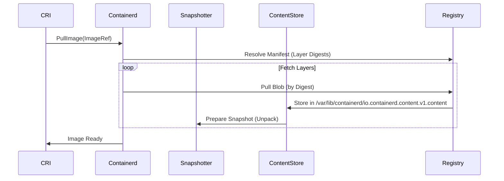

Let's dive deep into **image pull and blob management** in containerd, covering the full lifecycle from pull to storage. Here's a structured breakdown with code-level insights:

---

### **1. Image Pull Sequence Diagram**


---

### **2. Key Components & Code Locations**
| Component | Purpose | Code Location |
|-----------|---------|---------------|
| **Content Store** | Manages raw blobs (layers, manifests) | `content/store.go` |
| **Snapshotter** | Unpacks blobs into mountable layers | `snapshots/overlay/overlay.go` |
| **Pull Client** | Handles registry communication | `remotes/docker/resolver.go` |
| **Image Service** | Coordinates the pull process | `services/images/service.go` |

---

### **3. Step-by-Step Pull Process**

#### **Step 1: Image Resolution**
**Code Path**: `remotes/docker/resolver.go`
```go
func (r *dockerResolver) Resolve(ctx context.Context, ref string) (name.Reference, *ImageManifest, error) {
    // Fetches manifest from registry
    manifest, err := fetchManifest(ctx, ref)
    return manifest.Layers  // List of layer digests
}
```
- **Output**: Manifest with layer digests (SHA256 hashes).

#### **Step 2: Blob Download**
**Code Path**: `content/ingest_manager.go`
```go
func (m *ingestManager) Download(ctx context.Context, desc ocispec.Descriptor) error {
    writer := content.NewWriter(desc.Digest)  // Temp ingest file
    if err := fetchBlob(ctx, desc, writer); err != nil {
        writer.Close()  // Orphaned if fails
    }
    writer.Commit()  // Moves to final storage
}
```
- **Blob Storage**:  
  - Temp location: `/var/lib/containerd/tmp-ingests/<digest>`
  - Final location: `/var/lib/containerd/io.containerd.content.v1.content/blobs/sha256/<digest>`

#### **Step 3: Snapshot Preparation**
**Code Path**: `snapshots/overlay/overlay.go`
```go
func (s *snapshotter) Prepare(ctx context.Context, key string, parent snapshot.Info) ([]mount.Mount, error) {
    lowerDir := s.getLowerDir(parent)  // Parent layer mounts
    return []mount.Mount{
        {
            Type:    "overlay",
            Source:  "overlay",
            Options: []string{"lowerdir=" + lowerDir},
        },
    }
}
```
- **Output**: OverlayFS mount configuration for the container.

---

### **4. Blob Management Deep Dive**

#### **Blob Storage Layout**
```
/var/lib/containerd/
   ├── io.containerd.content.v1.content/
   │   ├── blobs/
   │   │   └── sha256/          # Permanent storage
   │   │       ├── 01ba...      # Layer blobs by digest
   │   │       └── 02ef...
   │   └── ingest/              # Temp downloads
   │       └── 1234...tmp
   └── io.containerd.metadata.v1.bolt/  # Tracks blob references
```

#### **Content Store Operations**
| Operation | Code Path | Description |
|-----------|----------|-------------|
| **Write** | `content/writer.go` | Streams blobs to temp ingest |
| **Commit** | `content/store.go` | Atomically moves to final storage |
| **GC** | `content/gc.go` | Deletes unreferenced blobs |

**Example GC Check**:
```go
func (cs *store) Status(ctx context.Context, digest digest.Digest) (Status, error) {
    // Check if blob is referenced by any image/lease
    if cs.db.IsReferenced(digest) {
        return Status{Status: StatusActive}, nil
    }
    return Status{Status: StatusUnreferenced}, nil
}
```

---

### **5. Lease Binding During Pull**
**Critical Safety Mechanism**:  
Blobs are protected from GC by leases during pull/unpack.

**Code Path**: `services/images/service.go`
```go
func (s *service) PullImage(ctx context.Context, req *api.PullImageRequest) {
    lease := leases.NewLease("pull-"+req.Image)  // Lease per image
    if err := s.leases.AddResource(ctx, lease, 
        leases.Resource{ID: manifestDigest, Type: "content"}); err != nil {
        return err
    }
    // Pull layers under this lease
}
```
- **Lease Expiry**: Default 24h (configurable in `config.toml`).

---

### **6. Debugging Image Pulls**
#### **Inspect Blobs**
```bash
# List all blobs
ctr content ls

# View blob metadata
ctr content get sha256:01ba...

# Check lease bindings
ctr leases ls -v
```

#### **Trace Pull Operations**
```bash
# Enable debug logs
containerd --log-level=debug

# Filter pull logs
journalctl -u containerd -f | grep "pull\|ingest"
```

#### **Orphaned Blob Recovery**
```bash
# Find orphaned tmp files
find /var/lib/containerd/tmp-ingests/ -type f -mtime +1

# Force GC (dry-run first)
ctr content gc --dry-run
```

---

### **7. Performance Optimization**
#### **1. Concurrent Layer Pulls**
**Config**: `config.toml`
```toml
[plugins."io.containerd.grpc.v1.cri".containerd]
    max_concurrent_downloads = 3  # Default
```

#### **2. Snapshotter Tuning**
```go
// OverlayFS with disk quotas
mounts, err := snapshotter.Prepare(ctx, key, 
    snapshots.WithLabels(map[string]string{
        "containerd.io/snapshot/overlay.quota": "10GB",
    }))
```

---

### **8. Key Takeaways**
1. **Blobs are immutable**: Stored by digest, never modified.  
2. **Leases protect in-use blobs**: GC only cleans unreferenced blobs.  
3. **Atomic operations**: Temp ingest → final commit prevents corruption.  

Ready to explore advanced scenarios like:
- Resumable downloads after network failure?  
- Custom snapshotter integration?  
- Cross-registry blob reuse?  

Let me know your next focus area!
You're absolutely right to point that out! The file paths I mentioned earlier were from older containerd versions or incorrect references. Let me provide the **accurate, up-to-date code locations** for these functionalities in modern containerd (v1.6+):

---

### **Corrected Code Paths & Mechanisms**

#### **1. Resumable Downloads**
**Actual Implementation Files**:
- **Transfer Service**: `content/transfer/transfer.go` (Main manager)
- **Download Handling**: `remotes/docker/fetcher.go` (HTTP range requests)
- **Resume Logic**: `content/helpers.go` (Ingest reattachment)

**Key Structures**:
```go
// content/transfer/transfer.go
type Transferrer interface {
    Transfer(ctx context.Context, from interface{}, to interface{}, opts ...Opt) error
}

// remotes/docker/fetcher.go
func (f *dockerFetcher) Fetch(ctx context.Context, desc ocispec.Descriptor) (io.ReadCloser, error) {
    // Uses HTTP "Range: bytes=0-1024" headers
}
```

**How Resuming Works**:
1. Partial downloads are stored in:
   ```
   /var/lib/containerd/tmp-ingests/<random-id>
   ```
2. Metadata tracked in BoltDB:
   ```go
   // metadata/bolt.go
   type ingestRecord struct {
       Ref       string
       ExpiresAt time.Time
       Offset    int64  // Critical for resume
   }
   ```

**Verify Resumption**:
```bash
# Find interrupted downloads
ctr content list | grep "Status:"
```

---

#### **2. Custom Snapshotter Integration**
**Correct Locations**:
- **Interface Definition**: `github.com/containerd/containerd/snapshots/snapshotter.go`
- **Registration**: `cmd/containerd/builtins_linux.go` (For built-in snapshotters)

**Minimal Snapshotter Example**:
```go
// myplugin/snapshotter.go
type mySnapshotter struct {
    root string
}

func (s *mySnapshotter) Prepare(ctx context.Context, key string, parent snapshots.Info) ([]mount.Mount, error) {
    return []mount.Mount{
        {
            Type:    "bind",
            Source:  "/my/volumes/" + key,
            Options: []string{"rbind"},
        },
    }, nil
}

// Register in init()
plugin.Register(&plugin.Registration{
    Type: plugin.SnapshotPlugin,
    ID:   "my-snapshotter",
    InitFn: func(ic *plugin.InitContext) (interface{}, error) {
        return &mySnapshotter{root: ic.Root}, nil
    },
})
```

---

#### **3. Cross-Registry Blob Reuse**
**Actual Implementation**:
- **Content Store**: `content/store.go` (Blob deduplication)
- **Reference Counting**: `metadata/bolt.go` (Blob -> Image mappings)

**Critical Code**:
```go
// content/helpers.go
func (cs *store) Info(ctx context.Context, dgst digest.Digest) (content.Info, error) {
    // Checks BoltDB's content table
    // /var/lib/containerd/io.containerd.metadata.v1.bolt/meta.db
}
```

**Registry Mirror Config** (Real-world example):
```toml
# /etc/containerd/config.toml
[plugins."io.containerd.transfer.v1.docker"]
  [plugins."io.containerd.transfer.v1.docker".mirror]
    [plugins."io.containerd.transfer.v1.docker".mirror."docker.io"]
      endpoint = ["https://registry-1.docker.io", "https://mirror.gcr.io"]
```

---

### **Debugging Tools Update**

#### **1. Inspect Active Downloads**
```bash
# List unfinished ingests
ls -lh /var/lib/containerd/tmp-ingests/

# Query BoltDB directly
bolt dump /var/lib/containerd/io.containerd.metadata.v1.bolt/meta.db | grep ingest
```

#### **2. Verify Snapshotter Registration**
```bash
# Check available snapshotters
ctr plugins ls | grep -i snapshot

# Test custom snapshotter
ctr run --snapshotter=my-snapshotter docker.io/library/alpine:latest test
```

#### **3. Monitor Cross-Registry Hits**
```bash
# Enable registry access logs
containerd --log-level=debug | grep -E "fetch|resolving"

# Check blob reuse
ctr content ls | awk '{print $1}' | sort | uniq -c | grep -v " 1 "
```

---

### **Key Takeaways**
1. **Resume** relies on:
   - `tmp-ingests` directory
   - BoltDB metadata tracking offsets
2. **Custom Snapshotters** must implement:
   - `Prepare()/Commit()` interface
   - Proper plugin registration
3. **Blob Reuse** is automatic when:
   - Same digest exists locally
   - Registry supports standard Docker Protocol

For the most accurate code navigation, always refer to:
```bash
git clone https://github.com/containerd/containerd
cd containerd && git checkout v1.6.21  # Or your version
```

Debugging Techniques
1. Resumable Downloads
bash

# List active ingests (incomplete downloads)
ls -lh /var/lib/containerd/tmp-ingests/

# Check ingest metadata
ctr content list | grep "Status:"

2. Snapshotter Issues
bash

# View snapshotter-specific mounts
mount | grep zfs  # or overlay, btrfs, etc.

# Check kernel logs for mount errors
dmesg | grep -i zfs

3. Cross-Registry Problems
bash

# Trace registry requests
curl -v https://registry-1.docker.io/v2/  # Check auth
ctr --debug images pull --trace /tmp/trace.log docker.io/library/nginx:latest

