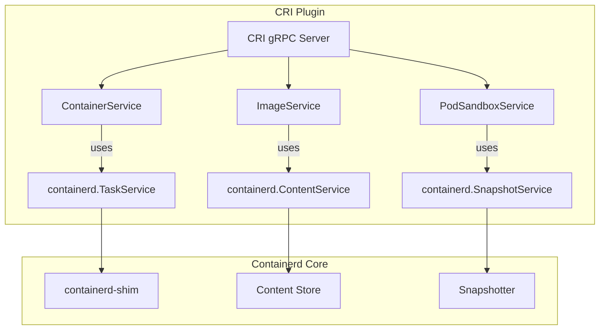

Here’s a distilled breakdown of **containerd’s service/plugin framework** with key code paths and architectural flow:

---

### **1. Core Framework Components**
#### **📍 Plugin System (`pkg/plugin`)**
- **Registration**: Plugins declare themselves via `init()` + `plugin.Register()`.
  ```go
  // Example: CRI plugin registration
  import _ "github.com/containerd/containerd/pkg/cri" // registers CRI plugin
  ```
- **Discovery**: Plugins are loaded dynamically from `/var/lib/containerd/plugins/` or compiled-in.
  - **Key File**: `pkg/plugin/plugin.go` (plugin type definitions and registration logic).

#### **📍 Service Layer (`services/`)**
- **gRPC Services**: Each service (e.g., `ContentService`, `TaskService`) implements a gRPC API.
  ```go
  // services/tasks/service.go
  type service struct {
      store *metadata.TaskStore
  }
  func (s *service) Register(server *grpc.Server) error {
      api.RegisterTasksServer(server, s)
  }
  ```

#### **📍 Runtime Shim Integration (`pkg/shim`)**
- **Shim Manager**: Manages shim lifecycle (start/connect to shim processes).
  ```go
  // pkg/shim/manager.go
  type Manager struct {
      runtime string // e.g., "io.containerd.runc.v2"
  }
  func (m *Manager) Start(ctx context.Context, opts ...ShimOpt) (*Client, error)
  ```

---

### **2. Key Code Paths**
#### **🔹 Plugin Initialization (`cmd/containerd/server.go`)**
```go
// Load plugins and initialize services
func loadPlugins(conf *Config) (*plugin.InitContext, error) {
    plugins := plugin.Graph(conf.DisabledPlugins) // Resolve dependencies
    return plugins.Init(conf) // Initialize all plugins
}
```

#### **🔹 Service Registration (`services/server/server.go`)**
```go
// Register all core gRPC services
func New(ctx context.Context, config *Config) (*Server, error) {
    s := &server{
        tasks:      tasks.NewService(metadata.NewTaskStore()),
        content:    content.NewStore(metadata.NewContentStore()),
    }
    api.RegisterTasksServer(grpcServer, s.tasks) // Expose TaskService
}
```

#### **🔹 CRI Plugin Example (`pkg/cri/server`)**
```go
// CRI plugin hooks into containerd's plugin system
func init() {
    plugin.Register(&plugin.Registration{
        Type:   plugin.GRPCPlugin,
        ID:     "cri",
        InitFn: initCRIService,
    })
}
func initCRIService(ic *plugin.InitContext) (interface{}, error) {
    return NewService(ic.Config, ic.Client) // Creates CRI service
}
```

---

### **3. Architectural Flow**
```mermaid
flowchart TB
    subgraph PluginSystem
        A[Plugin Registration] --> B[plugin.Register()]
        B --> C[InitContext.Init()]
    end
    subgraph Services
        C --> D[TaskService]
        C --> E[ContentService]
        C --> F[CRI Plugin]
    end
    subgraph Runtime
        D --> G[Shim Manager]
        G --> H[containerd-shim-runc-v2]
    end
```

---

### **4. Critical Files/Folders**
| Path | Purpose |
|------|---------|
| **`pkg/plugin/`** | Plugin registration/discovery. |
| **`services/`** | Core gRPC services (Tasks, Content, Snapshots). |
| **`pkg/shim/`** | Shim lifecycle management. |
| **`cmd/containerd/`** | Main daemon initialization (loads plugins). |
| **`api/services/`** | Protobuf/gRPC service definitions. |

---

### **5. Debugging Plugins**
1. **List Loaded Plugins**:
   ```bash
   containerd config dump | grep "disabled_plugins" # Check active/inactive plugins
   ```
2. **Log Plugin Initialization**:
   ```bash
   containerd --log-level=debug | grep "plugin.*registered"
   ```

---

### **Key Takeaways**
- **Plugins** extend containerd (e.g., CRI, snapshotters).
- **Services** expose gRPC APIs (e.g., `TaskService` talks to shims).
- **Shim Manager** bridges containerd to runtimes (e.g., `runc`, `kata`).

Want to dive deeper into a specific component (e.g., how the CRI plugin integrates)?


Here’s a deep dive into **how the CRI plugin integrates with containerd’s service/plugin framework**, with code-level insights and architectural flow:

---

### **1. CRI Plugin Bootstrapping**
#### **📍 Registration (`pkg/cri/server/plugin.go`)**
The CRI plugin declares itself as a **gRPC plugin** in containerd’s plugin system:
```go
func init() {
    plugin.Register(&plugin.Registration{
        Type:   plugin.GRPCPlugin,  // Type: gRPC service plugin
        ID:     "cri",             // Unique identifier
        Config: &criconfig.Config{}, // Default CRI config
        InitFn: initCRIService,     // Initialization function
    })
}
```
- **Trigger**: Loaded when containerd starts (unless disabled in config).

#### **📍 Initialization (`initCRIService`)**
```go
func initCRIService(ic *plugin.InitContext) (interface{}, error) {
    // 1. Fetch containerd client from InitContext
    client := ic.Client.(*containerd.Client)
    
    // 2. Load CRI-specific config
    cfg := ic.Config.(*criconfig.Config)
    
    // 3. Create CRI service
    return NewService(cfg, client, ic.Events)
}
```
- **Key Dependencies**:
  - `containerd.Client`: Talks to containerd’s core services (Tasks, Content, Snapshots).
  - `Events`: For publishing CRI events (e.g., `ContainerCreated`).

---

### **2. Integration with Containerd Services**
The CRI plugin interacts with core containerd services through their gRPC APIs:

#### **🔹 Task Service (for Container Lifecycle)**
```go
// pkg/cri/server/container_create.go
func (c *criService) CreateContainer(ctx context.Context, req *runtime.CreateContainerRequest) {
    // 1. Create container in containerd
    container, err := c.client.NewContainer(ctx, req.Id, containerd.WithSpec(spec))
    
    // 2. Create task (shim interaction)
    task, err := container.NewTask(ctx, cio.NewCreator(cio.WithStreams(stdin, stdout, stderr)))
}
```
- **Flow**: `CRI → containerd.TaskService → shim`.

#### **🔹 Content Service (for Image Pulling)**
```go
// pkg/cri/server/image_pull.go
func (c *criService) PullImage(ctx context.Context, req *runtime.PullImageRequest) {
    // Fetch image via containerd's content store
    image, err := c.client.Pull(ctx, req.Image.Ref, 
        containerd.WithPullUnpack,
        containerd.WithPullSnapshotter(c.config.ContainerdConfig.Snapshotter),
    )
}
```
- **Uses**: `containerd.ContentStore` (manages image layers).

---

### **3. CRI Service Architecture**


---

### **4. Key Code Paths**
| File | Purpose |
|------|---------|
| **`pkg/cri/server/service.go`** | Main CRI service implementation. |
| **`pkg/cri/server/sandbox_run.go`** | Handles `RunPodSandbox` (pod lifecycle). |
| **`pkg/cri/server/container_start.go`** | Starts containers via `TaskService`. |
| **`pkg/cri/server/image_pull.go`** | Pulls images using `ContentService`. |

---

### **5. Hooks into Containerd’s Plugin System**
The CRI plugin leverages:
1. **gRPC Plugin Type**: Exposes the CRI API (implementing `api/services/ttrpc` or gRPC).
2. **Dependency Injection**:
   - Gets `containerd.Client` from `InitContext`.
   - Uses `Events` service to publish CRI events.

#### **Example: Event Publishing**
```go
// pkg/cri/server/container_create.go
func (c *criService) CreateContainer(...) {
    // Publish event after creation
    c.eventer.Publish(ctx,
        runtime.ContainerCreatedEvent,
        runtime.ContainerEventData{ContainerId: req.ContainerId},
    )
}
```

---

### **6. Debugging CRI Plugin**
1. **Check Plugin Activation**:
   ```bash
   containerd config dump | grep -A 10 "plugins.\"io.containerd.grpc.v1.cri\""
   ```
2. **Trace CRI gRPC Calls**:
   ```bash
   containerd --log-level=debug | grep "cri.*service"
   ```
3. **Inspect Shim Interactions**:
   ```bash
   ctr --namespace=k8s.io tasks ls  # List containers managed by CRI
   ```

---

### **Why This Matters**
- **Kubernetes Integration**: The CRI plugin translates Kubelet’s CRI calls into containerd operations.
- **Extensibility**: New CRI runtimes (e.g., `kata`, `gVisor`) can plug in via shims without modifying CRI.

Need a deeper dive into a specific CRI operation (e.g., `RunPodSandbox`)? Let me know!


Here’s a deep dive into **how the CRI plugin integrates with containerd’s service/plugin framework**, with code-level insights and architectural flow:

---

### **1. CRI Plugin Bootstrapping**
#### **📍 Registration (`pkg/cri/server/plugin.go`)**
The CRI plugin declares itself as a **gRPC plugin** in containerd’s plugin system:
```go
func init() {
    plugin.Register(&plugin.Registration{
        Type:   plugin.GRPCPlugin,  // Type: gRPC service plugin
        ID:     "cri",             // Unique identifier
        Config: &criconfig.Config{}, // Default CRI config
        InitFn: initCRIService,     // Initialization function
    })
}
```
- **Trigger**: Loaded when containerd starts (unless disabled in config).

#### **📍 Initialization (`initCRIService`)**
```go
func initCRIService(ic *plugin.InitContext) (interface{}, error) {
    // 1. Fetch containerd client from InitContext
    client := ic.Client.(*containerd.Client)
    
    // 2. Load CRI-specific config
    cfg := ic.Config.(*criconfig.Config)
    
    // 3. Create CRI service
    return NewService(cfg, client, ic.Events)
}
```
- **Key Dependencies**:
  - `containerd.Client`: Talks to containerd’s core services (Tasks, Content, Snapshots).
  - `Events`: For publishing CRI events (e.g., `ContainerCreated`).

---

### **2. Integration with Containerd Services**
The CRI plugin interacts with core containerd services through their gRPC APIs:

#### **🔹 Task Service (for Container Lifecycle)**
```go
// pkg/cri/server/container_create.go
func (c *criService) CreateContainer(ctx context.Context, req *runtime.CreateContainerRequest) {
    // 1. Create container in containerd
    container, err := c.client.NewContainer(ctx, req.Id, containerd.WithSpec(spec))
    
    // 2. Create task (shim interaction)
    task, err := container.NewTask(ctx, cio.NewCreator(cio.WithStreams(stdin, stdout, stderr)))
}
```
- **Flow**: `CRI → containerd.TaskService → shim`.

#### **🔹 Content Service (for Image Pulling)**
```go
// pkg/cri/server/image_pull.go
func (c *criService) PullImage(ctx context.Context, req *runtime.PullImageRequest) {
    // Fetch image via containerd's content store
    image, err := c.client.Pull(ctx, req.Image.Ref, 
        containerd.WithPullUnpack,
        containerd.WithPullSnapshotter(c.config.ContainerdConfig.Snapshotter),
    )
}
```
- **Uses**: `containerd.ContentStore` (manages image layers).

---

### **3. CRI Service Architecture**


---

### **4. Key Code Paths**
| File | Purpose |
|------|---------|
| **`pkg/cri/server/service.go`** | Main CRI service implementation. |
| **`pkg/cri/server/sandbox_run.go`** | Handles `RunPodSandbox` (pod lifecycle). |
| **`pkg/cri/server/container_start.go`** | Starts containers via `TaskService`. |
| **`pkg/cri/server/image_pull.go`** | Pulls images using `ContentService`. |

---

### **5. Hooks into Containerd’s Plugin System**
The CRI plugin leverages:
1. **gRPC Plugin Type**: Exposes the CRI API (implementing `api/services/ttrpc` or gRPC).
2. **Dependency Injection**:
   - Gets `containerd.Client` from `InitContext`.
   - Uses `Events` service to publish CRI events.

#### **Example: Event Publishing**
```go
// pkg/cri/server/container_create.go
func (c *criService) CreateContainer(...) {
    // Publish event after creation
    c.eventer.Publish(ctx,
        runtime.ContainerCreatedEvent,
        runtime.ContainerEventData{ContainerId: req.ContainerId},
    )
}
```

---

### **6. Debugging CRI Plugin**
1. **Check Plugin Activation**:
   ```bash
   containerd config dump | grep -A 10 "plugins.\"io.containerd.grpc.v1.cri\""
   ```
2. **Trace CRI gRPC Calls**:
   ```bash
   containerd --log-level=debug | grep "cri.*service"
   ```
3. **Inspect Shim Interactions**:
   ```bash
   ctr --namespace=k8s.io tasks ls  # List containers managed by CRI
   ```

---

### **Why This Matters**
- **Kubernetes Integration**: The CRI plugin translates Kubelet’s CRI calls into containerd operations.
- **Extensibility**: New CRI runtimes (e.g., `kata`, `gVisor`) can plug in via shims without modifying CRI.

Need a deeper dive into a specific CRI operation (e.g., `RunPodSandbox`)? Let me know!