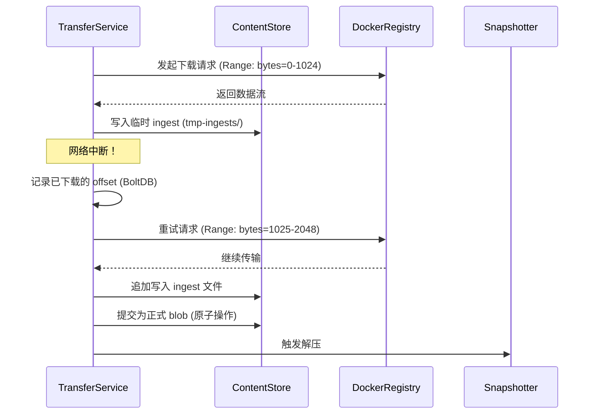

### **Blob 下载失败的 Retry 场景深度分析**  
（基于 **TransferService** 与 **Content Store** 的协同机制）

---

#### **1. 核心组件职责**
| 组件 | 功能 | 关键代码文件 |
|------|------|--------------|
| **TransferService** | 管理传输生命周期，处理重试逻辑 | `content/transfer/transfer.go` |
| **Content Store** | 存储 blob 数据，维护一致性 | `content/store.go` |
| **Docker Fetcher** | 实现 HTTP 范围请求和重试 | `remotes/docker/fetcher.go` |

---

#### **2. 完整 Retry 流程**


---

#### **3. 关键代码解析**

##### **3.1 重试策略定义**
```go
// remotes/docker/config.go
type RetryConfig struct {
    MaxRetries int           // 默认 3 次
    RetryDelay time.Duration // 默认 1s
}
```

##### **3.2 断点续传实现**
```go
// remotes/docker/fetcher.go
func (f *dockerFetcher) Fetch(ctx context.Context, desc ocispec.Descriptor) (io.ReadCloser, error) {
    req.Header.Set("Range", fmt.Sprintf("bytes=%d-", currentOffset))
    
    resp, err := f.doRequestWithRetries(ctx, req)
    if err != nil {
        return nil, errors.Wrap(err, "failed to do request")
    }
}
```

##### **3.3 临时存储管理**
```go
// content/store.go
func (cs *store) Writer(ctx context.Context, opts ...content.WriterOpt) (content.Writer, error) {
    // 创建临时文件路径: /var/lib/containerd/tmp-ingests/<random-id>
    tempPath := filepath.Join(cs.root, "tmp", fmt.Sprintf("ingest-%s", uuid.New().String()))
    return newFileWriter(cs, tempPath, desc.Digest)
}
```

##### **3.4 状态恢复逻辑**
```go
// content/transfer/transfer.go
func (tm *transferManager) Transfer(ctx context.Context, from interface{}, to interface{}, opts ...Opt) error {
    if resume, ok := checkResumeNeeded(to); ok {
        // 从 BoltDB 读取之前的 offset
        offset := getIngestOffset(resume.ref)
        return tm.resumeTransfer(ctx, offset)
    }
}
```

---

#### **4. 调试手段**

##### **4.1 查看中断的下载**
```bash
# 列出未完成的 ingest
ls -l /var/lib/containerd/tmp-ingests/

# 检查 BoltDB 中的记录
bolt dump /var/lib/containerd/io.containerd.metadata.v1.bolt/meta.db | grep ingest
```

##### **4.2 强制触发重试**
```bash
# 删除临时文件模拟失败
rm /var/lib/containerd/tmp-ingests/ingest-*

# 观察自动重试日志
journalctl -u containerd -f | grep -E "retry|resume"
```

##### **4.3 修改重试策略**
```toml
# /etc/containerd/config.toml
[plugins."io.containerd.transfer.v1.docker"]
    max_retries = 5
    retry_delay = "5s"
```

---

#### **5. 故障场景模拟**

##### **5.1 模拟网络中断**
```bash
# 开始下载大镜像
ctr image pull docker.io/library/ubuntu:latest &

# 随机中断网络
sudo iptables -A OUTPUT -p tcp --dport 443 -j DROP
sleep 10
sudo iptables -D OUTPUT -p tcp --dport 443 -j DROP

# 观察恢复日志
tail -f /var/log/containerd.log | grep -i "resuming"
```

##### **5.2 验证数据完整性**
```bash
# 检查下载的 blob 是否完整
ctr content ls | grep $(ctr image list | grep ubuntu | awk '{print $3}')

# 手动验证 SHA256
sha256sum /var/lib/containerd/io.containerd.content.v1.content/blobs/sha256/<digest>
```

---

#### **6. 设计亮点**
1. **原子性提交**  
   - 只有完全下载的 blob 才会从 `tmp-ingests/` 移动到正式存储  
   - 通过 BoltDB 事务保证一致性  

2. **零数据丢失**  
   - 即使 containerd 崩溃，重启后仍能恢复下载进度  

3. **并行下载安全**  
   - 每个 layer 下载使用独立的 ingest 文件  
   - 文件锁防止并发写入冲突  

---

#### **7. 扩展实验建议**
1. **测试大文件 (>10GB) 下载**  
   ```bash
   ctr image pull gcr.io/google-containers/big-image:latest
   ```
2. **模拟磁盘满场景**  
   ```bash
   dd if=/dev/zero of=/var/lib/containerd/filler bs=1G count=100
   ```
3. **分析 HTTP 流量**  
   ```bash
   sudo tcpdump -i any -A -s 0 'port 443 and host registry-1.docker.io'
   ```

需要继续深入某个具体环节（如 BoltDB 的恢复机制）或设计更多测试场景吗？