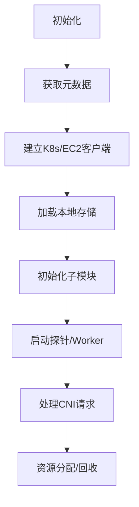

以下是针对该 Go 代码的全面分析，按您要求的 4 个维度展开：

---

### 1. **功能 & 结构概览**
#### **模块定位**
- **所属包**：`pinterest.com/cmp/noderuntime/nodemanager/manager`
- **核心职责**：管理 Kubernetes 节点的网络资源（ENI/IP/路由等），提供 CNI 插件调度、节点健康监测、QoS 控制等功能，是 AWS EC2 环境下的节点级网络控制器。

#### **主要执行流程**


---

### 2. **改进点扫描**
#### **性能层面**
- **重复计算**：`GetHostIP()` 和 `GetPrimaryInterfaceName()` 多次调用 `ec2MetaClient.GetHostPrimaryIP()`，建议缓存结果。
- **高开销操作**：`ListInterfaces()` 和 `Addrs()` 在循环中频繁调用，可能成为性能瓶颈（可改用 `netlink` 库优化）。
- **锁竞争**：`LocalStore` 的并发访问未显式同步，存在数据竞争风险。

#### **健壮性**
- **错误处理**：部分函数（如 `findPluginForAdd`）未处理 `annotations` 为空的情况。
- **并发安全**：`stopCh` 的关闭未加锁，可能触发 `panic`（建议用 `sync.Once`）。
- **EC2 依赖**：无重试机制，AWS API 限流时可能崩溃。

#### **可维护性**
- **模块耦合**：`NodeManagerImpl` 聚合了 8 个子模块，违反单一职责原则。
- **日志缺陷**：部分日志缺少关键字段（如 `containerID`），不利于排查问题。
- **魔法值**：`types.LargeImageAnnotation` 等硬编码字符串应定义为常量。

---

### 3. **Trace & Metrics 插入点**
#### **关键埋点位置**
| **埋点位置**               | **建议采集维度**                                                                 |
|----------------------------|---------------------------------------------------------------------------------|
| `findPluginForAdd/Del`     | 时戳、Pod Namespace/Name、NetworkMode、耗时、错误码                             |
| `GetPrimaryInterfaceName`  | 接口名、IP 列表大小、EC2 Metadata 调用耗时                                      |
| `DeleteNetConfForAssignment` | ContainerID、释放的 IP/ENI 数量、存储操作耗时                                 |
| `StartWorkers`             | 探针名称、启动耗时、资源初始化状态（如 IP 池大小）                              |

#### **GC/生命周期监控**
```go
// 示例：在 StartWorkers 中插入 GC 监控
import "runtime/debug"

func (e *NodeManagerImpl) StartWorkers() {
    go func() {
        debug.FreeOSMemory() // 主动触发 GC 快照
        Metrics.GCSnapshot.WithLabelValues(e.NodeName).Set(float64(time.Now().Unix()))
    }()
    // ...原有逻辑...
}
```

---

### 4. **与 containerd 对照 & 可借鉴之处**
#### **containerd 优秀实践**
- **事件总线**：通过 `EventService` 广播资源变更（如 `NetworkInterfaceAllocated`），解耦组件。
- **Snapshotter**：将本地存储抽象为分层快照，避免直接操作文件系统。
- **插件机制**：通过 `Registration` 动态加载 CNI 插件，而非硬编码 `getPlugin()`。

#### **改进建议**
- **引入 Event Bus**：将 `LocalStore` 的变更事件化，便于追踪资源流转。
  ```go
  // 示例事件定义
  type ResourceEvent struct {
      ContainerID string
      EventType   string // "IPAllocated"|"ENIReleased"
      Timestamp   time.Time
  }
  ```
- **插件化改造**：
  ```go
  // 替代现有 switch-case
  type PluginFactory interface {
      Create(dnsMode DNSModeDef) (ExternalPlugin, error)
  }
  var plugins = map[string]PluginFactory{
      DedicatedENIMode: &ECSENIPluginFactory{},
      BridgeMode:       &BridgeENIPluginFactory{},
  }
  ```

#### **主要差异**
| **维度**       | **当前实现**                          | **containerd 方案**                     |
|----------------|--------------------------------------|----------------------------------------|
| **资源管理**   | 集中式（NodeManagerImpl）            | 分片式（CNI Plugin + IPAM）            |
| **扩展性**     | 需修改核心代码添加新 NetworkMode     | 通过插件注册机制动态扩展               |
| **状态同步**   | 依赖本地存储                         | 使用 BoltDB + gRPC 状态同步服务        |

---

### **总结建议**
1. **性能优化**：缓存高频调用结果，用 `netlink` 替代 `net` 标准库。
2. **健壮性提升**：增加 AWS API 重试逻辑，用 `sync.Mutex` 保护共享状态。
3. **可观测性**：在关键路径插入 Prometheus Metrics 和 OpenTelemetry Trace。
4. **架构改进**：参考 containerd 的插件化设计，拆分 `NodeManagerImpl` 的上帝类。


In the provided Go code, `stopCh` (a `chan struct{}`) is used to control the lifecycle of background workers (probes, managers, etc.). Here's how it's managed and potential issues:

---

### **Current Implementation**
1. **Initialization**  
   Created in `NewNodeManager()` as an unbuffered channel:
   ```go
   stopCh: make(chan struct{})
   ```

2. **Worker Termination**  
   Closed in `StopWorkers()` to signal all workers to exit:
   ```go
   func (e *NodeManagerImpl) StopWorkers() {
       log.Infof("Stopping node manager workers ...")
       close(e.stopCh)  // Sends zero-value struct to all receivers
       e.resourceReporter.Stop()
       e.PodManager.Stop()
   }
   ```

3. **Worker Usage**  
   Example probe worker checking the channel:
   ```go
   func (p *Probe) Start(stopCh <-chan struct{}) {
       go func() {
           for {
               select {
               case <-stopCh:  // Triggers on close(stopCh)
                   return
               case <-time.After(p.interval):
                   p.runCheck()
               }
           }
       }()
   }
   ```

---

### **Potential Issues**
1. **Double Close Risk**  
   - If `StopWorkers()` is called multiple times, it will panic (`close` of closed channel).  
   - **Fix**: Use `sync.Once`:
     ```go
     var stopOnce sync.Once
     func (e *NodeManagerImpl) StopWorkers() {
         stopOnce.Do(func() {
             close(e.stopCh)
         })
     }
     ```

2. **Missing Context Propagation**  
   - Workers can't distinguish between graceful shutdown (e.g., SIGTERM) and errors.  
   - **Fix**: Use `context.Context` instead:
     ```go
     ctx, cancel := context.WithCancel(context.Background())
     defer cancel()  // Safe to call multiple times
     go worker(ctx)
     ```

3. **Blocking Workers**  
   - If a worker hangs (e.g., stuck in `runCheck()`), `stopCh` won't force termination.  
   - **Fix**: Add timeout to worker logic:
     ```go
     case <-time.After(p.interval):
         ctx, cancel := context.WithTimeout(context.Background(), 5*time.Second)
         p.runCheck(ctx)
         cancel()
     ```

---

### **Best Practices from Containerd**
Containerd's task service uses a **two-phase shutdown**:
1. **Signal (`close(stopCh)`)**  
   Notifies workers to start cleanup.
2. **Wait (`Wait()` goroutine)**  
   Ensures all workers exit before returning.

**Adapted Example**:
```go
func (e *NodeManagerImpl) StopWorkers() error {
    close(e.stopCh)  // Phase 1: Signal
    err := waitForWorkers()  // Phase 2: Wait (e.g., with sync.WaitGroup)
    return err
}
```

---

### **Key Recommendations**
1. **Prevent Double Close**  
   Use `sync.Once` or check channel state with `recover()`.

2. **Propagate Shutdown Reason**  
   Replace `stopCh` with `context.Context` to carry deadlines/cancellation reasons.

3. **Add Worker Timeouts**  
   Ensure no worker blocks shutdown indefinitely.

4. **Log Shutdown Events**  
   Record why `stopCh` was closed (e.g., "SIGTERM received").

5. **Consider Lease-Based Design**  
   Like containerd's `LeaseManager`, use expiration-based cleanup instead of imperative `close()`.