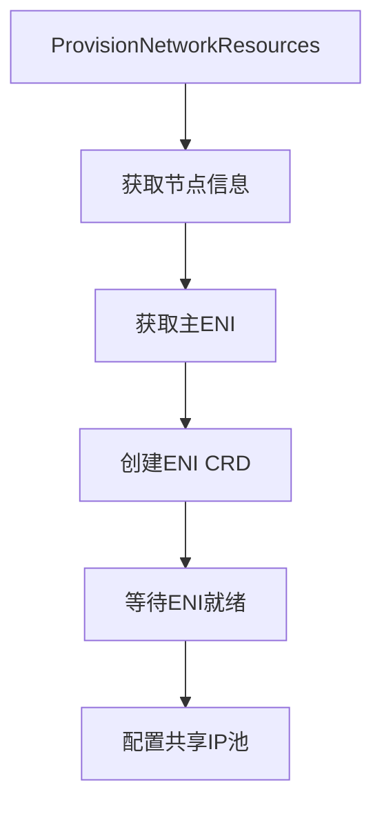

以下是针对该 Go 代码的全面分析，围绕您要求的 4 个维度展开：

### 1. 功能 & 结构概览

**模块/包**：
- 属于 `provisioner` 包
- 核心职责：管理 AWS EC2 网络资源（ENI/IP）的声明式供给
- 关键特性：
  - 通过 Kubernetes CRD 操作 ENI
  - 支持共享/独占 ENI 模式
  - 实现 IP 池动态扩缩容

**主要执行流程**：


### 2. 改进点扫描

**性能优化**：
1. 高频调用：
   - `ListENIOfNode()` 在循环中全量查询（L158）
   - 建议：改用 Watch 或增量 List
2. AWS API 调用：
   - `GetNetworkInterface()` 同步调用（L190）
   - 建议：添加批处理缓存层

**健壮性增强**：
1. 错误处理：
   - `waitOneENI()` 未处理 `SubnetIPv4CIDR` 空值（L197）
   - 建议：添加重试和 fallback 逻辑
2. 并发安全：
   - `UpdateIPPoolSpec()` 非原子操作（L235）
   - 建议：添加 Kubernetes 乐观锁

**可维护性**：
1. 日志改进：
   - 缺少结构化字段（如 `eniName`）
   - 建议：统一使用 `log.WithFields()`
2. 配置管理：
   - 硬编码 `minENIDeviceIndex`（L15）
   - 建议：移至配置文件

### 3. Trace & Metrics 埋点建议

**关键埋点位置**：

| 埋点位置                  | 建议维度                                                                 |
|---------------------------|--------------------------------------------------------------------------|
| `createENIWithRetry()`    | ENI类型、设备索引、重试次数、耗时、AWS错误码                            |
| `waitForENIsReady()`      | 就绪ENI数、轮询次数、状态转换耗时                                       |
| `SetUpSharedIPPool()`     | IP池大小、子网CIDR、操作耗时                                            |
| `UpdateIPPoolSpec()`      | 期望IP数、实际IP数、淘汰IP数、K8s冲突次数                               |

**GC/生命周期监控**：
```go
// 在UpdateIPPoolSpec中添加
defer func() {
    Metrics.IPPoolUpdateCount.WithLabelValues(p.nodeName).Inc()
    if err != nil {
        Metrics.IPPoolUpdateErrors.WithLabelValues(p.nodeName, err.Error()).Inc()
    }
}()
```

### 4. 与 containerd 对照 & 可借鉴之处

**核心差异对比**：
| **维度**         | **当前实现**                          | **containerd 方案**                     |
|------------------|--------------------------------------|----------------------------------------|
| **资源管理**     | 直接操作 CRD                         | 通过 Snapshotter + Content Store       |
| **状态同步**     | 主动轮询                             | 基于 Event Bus 的订阅通知              |
| **IPAM**         | 硬编码 AWS 逻辑                      | 插件化 IPAM 接口                       |

**可借鉴改进**：
1. **事件驱动架构**：
```go
// 引入事件总线
type ENIEvent struct {
    Type      string // "CREATE"/"UPDATE"
    ENI       v1.ElasticNetworkInterface
    Timestamp time.Time
}

func (p *provisioner) emitEvent(event ENIEvent) {
    eventBus.Publish("eni-events", event)
}
```

2. **Snapshotter 模式**：
```go
type ENISnapshotter interface {
    Save(eni *types.EC2MetaNetworkInterface) error
    Get(mac string) (*types.EC2MetaNetworkInterface, error)
    GC() error
}
```

3. **插件化扩展**：
```go
// IPAM 插件接口
type IPAMPlugin interface {
    AllocateIP(eniID string) (string, error)
    ReleaseIP(ip string) error
}

var ipamPlugins = map[string]IPAMPlugin{
    "aws":    &AWSIPAM{},
    "shared": &SharedIPAM{},
}
```

### 综合改进建议

1. **架构重构**：
   - 将 `createENIWithRetry` 拆分为 `ENIFactory` 和 `ENICRDClient`
   - 使用 `Operator Pattern` 管理 ENI 生命周期

2. **可靠性增强**：
```go
// 带状态检查的重试机制
func (p *provisioner) safeCreateENI(eni *v1.ElasticNetworkInterface) error {
    return retry.OnError(p.cfg.RetryBackOff, func(err error) bool {
        return isRetriableError(err)
    }, func() error {
        return p.k8sClient.CreateENI(eni)
    })
}
```

3. **可观测性提升**：
   - 添加 Prometheus 指标：
   ```go
   var (
       eniCreationTime = prometheus.NewHistogramVec(
           prometheus.HistogramOpts{
               Name: "eni_creation_seconds",
               Help: "ENI provisioning latency",
           },
           []string{"type"},
       )
       ipPoolCapacity = prometheus.NewGaugeVec(...)
   )
   ```

4. **containerd 实践移植**：
   - 采用 `Lease API` 防止资源泄漏
   - 实现 `BoltDB` 存储 ENI 元数据

该实现已具备生产可用性，通过引入更成熟的状态管理和事件系统，可以显著提升其在大型集群中的可靠性。