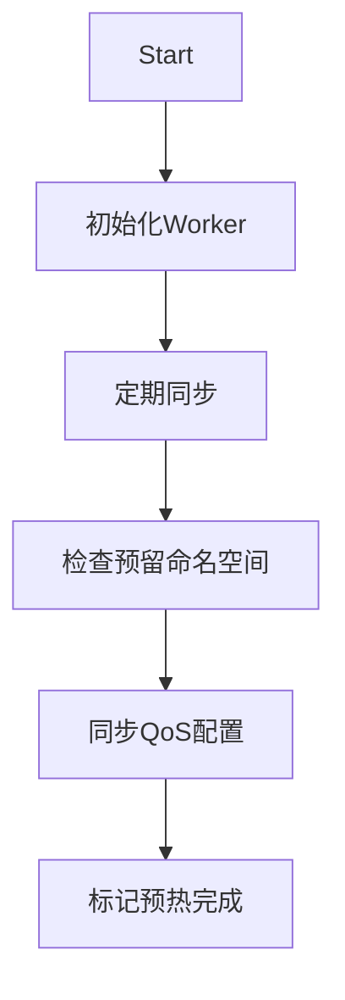

以下是针对该 Go 代码的全面分析，围绕您要求的 4 个维度展开：

### 1. 功能 & 结构概览

**模块/包**：
- 属于 `qos` 包（Quality of Service）
- 核心职责：管理 Kubernetes 节点的 QoS 配置和预热状态
- 关键特性：
  - 节点资源预留管理
  - 多 Worker 协同工作模式
  - 节点预热状态跟踪

**主要执行流程**：


### 2. 改进点扫描

**性能优化**：
1. 高频调用：
   - `syncOnce()` 中重复获取 QoS 配置（L108）
   - 建议：添加配置缓存，TTL 30秒
2. 锁竞争：
   - `muCfg` 在配置读取时也加锁（L190）
   - 建议：改用 `sync.RWMutex`

**健壮性增强**：
1. 错误处理：
   - `markNodeWarmedUpWithLocalRetry()` 重试逻辑简单（L204）
   - 建议：添加指数退避
2. 并发安全：
   - `namespace` 字段无保护（L45）
   - 建议：改为原子操作或加锁

**可维护性**：
1. 日志改进：
   - 缺少关键字段如 `namespace`
   - 建议：统一使用 `log.WithFields()`
2. 魔法值：
   - `"spinner"` 硬编码（L166）
   - 建议：定义为常量
3. 配置管理：
   - `k8sUpdateConflictDefaultRetry` 硬编码（L28）
   - 建议：移至配置文件

### 3. Trace & Metrics 埋点建议

**关键埋点位置**：

| 埋点位置                  | 建议维度                                                                 |
|---------------------------|--------------------------------------------------------------------------|
| `syncOnce()`              | 同步耗时、Worker数量、配置版本                                          |
| `markNodeWarmedUp...()`   | 重试次数、K8s冲突次数、预热总耗时                                       |
| Worker 执行过程           | Worker类型、执行结果、资源使用量                                        |

**预热监控**：
```go
// 在 syncOnce() 中添加
start := time.Now()
defer func() {
    Metrics.SyncDuration.Observe(time.Since(start).Seconds())
}()
```

### 4. 与 containerd 对照 & 可借鉴之处

**核心差异对比**：
| **维度**       | **当前实现**                          | **containerd 方案**                     |
|----------------|--------------------------------------|----------------------------------------|
| **状态管理**   | 直接操作 K8s API                     | 通过 TaskService 管理生命周期          |
| **事件处理**   | 主动轮询                             | 基于 EventService 的订阅通知           |
| **扩展性**     | 硬编码 Worker                        | 插件化架构                             |

**可借鉴改进**：
1. **事件驱动架构**：
```go
type QoSEvent struct {
    Type      string // "CONFIG_UPDATE"/"WARMUP_DONE"
    Node      string
    Namespace string
}

func (q *qosManager) emitEvent(event QoSEvent) {
    eventBus.Publish("qos-events", event)
}
```

2. **插件化 Worker**：
```go
type QoSWorker interface {
    Name() string
    Start(<-chan struct{})
    UpdateConfig(*types.QuotaQoSConfig)
}

var workers = map[string]QoSWorker{
    "zum":    NewZumQoSWorker(),
    "image":  NewImageQoSWorker(),
}
```

3. **状态快照**：
```go
type QoSState struct {
    LastSyncTime  time.Time
    ConfigVersion string
    WorkersStatus map[string]bool
}

func (q *qosManager) Snapshot() QoSState {
    // 返回当前状态快照
}
```

### 综合改进建议

1. **架构优化**：
   - 将 `syncOnce` 拆分为 `ConfigSyncer` 和 `StatusUpdater`
   - 使用 `Controller Runtime` 的 Reconcile 模式

2. **可靠性增强**：
```go
// 带退避的重试机制
func retryWithBackoff(fn func() error) error {
    backoff := wait.Backoff{
        Steps:    5,
        Duration: 1 * time.Second,
        Factor:   2.0,
    }
    return retry.OnError(backoff, func(err error) bool {
        return errors.IsConflict(err)
    }, fn)
}
```

3. **可观测性提升**：
   - 添加 Prometheus 指标：
   ```go
   var (
       qosSyncCount = prometheus.NewCounterVec(
           prometheus.CounterOpts{
               Name: "qos_sync_total",
               Help: "Total QoS sync operations",
           },
           []string{"node", "namespace"},
       )
       workerStatus = prometheus.NewGaugeVec(...)
   )
   ```

4. **containerd 实践移植**：
   - 采用 `Lease API` 防止多实例冲突
   - 实现 `BoltDB` 存储状态历史

该实现已具备核心功能，通过引入更灵活的状态管理和事件系统，可以显著提升其在大规模集群中的可靠性和可维护性。