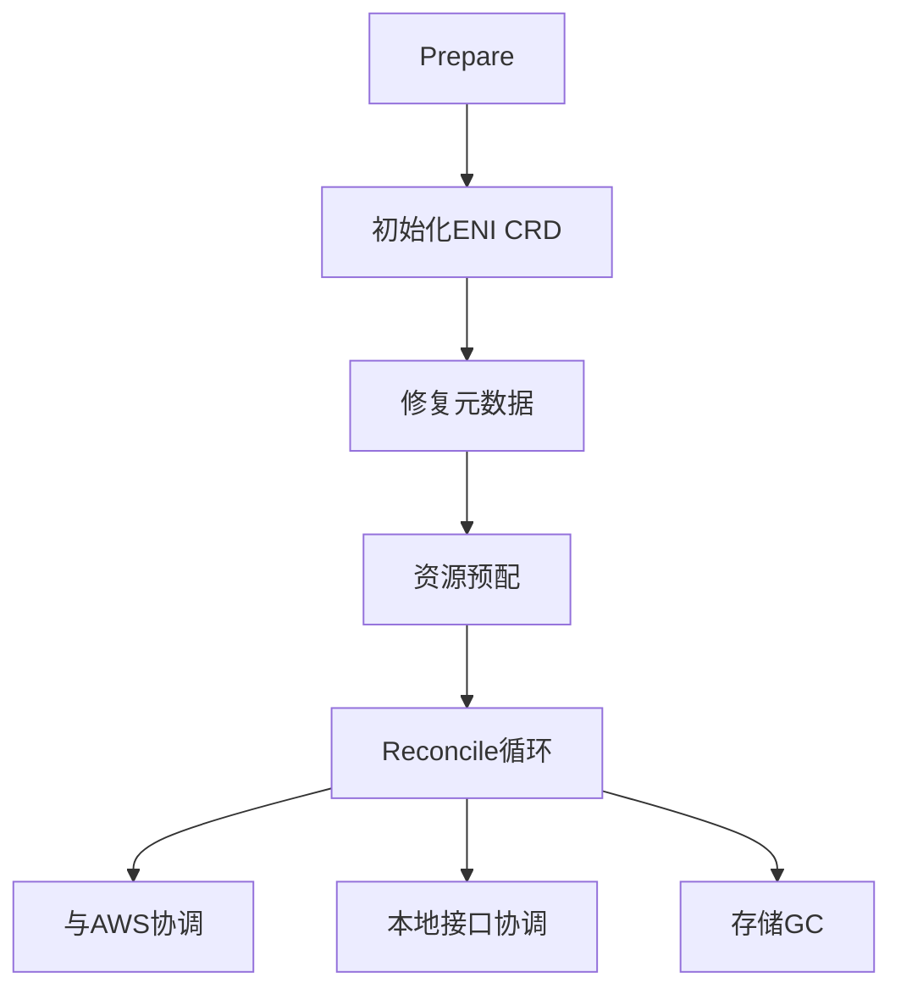
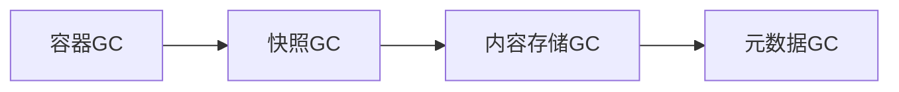

Here's a comprehensive analysis of the provided Go code across your requested dimensions:

### 1. 功能 & 结构概览

**模块/包**：
- 属于`manager`包，是节点网络资源协调器
- 核心职责：在AWS元数据、本地存储和Kubernetes之间保持网络接口(ENI)状态一致

**主要执行流程**：


### 2. 改进点扫描

**性能优化**：
1. 高频调用优化：
   - `doGetLocalENIs()`和`ListNetworkInterfaces()`存在重复调用
   - 建议：添加缓存层，TTL 30秒
2. 昂贵的AWS API调用：
   - `GetENIPrivateDNSName()`在循环中同步调用
   - 建议：批量查询或异步预加载

**健壮性增强**：
1. 错误处理：
   - `tryRecoverENIPrimaryIP()`未处理DNS解析失败
   - 建议：添加重试机制和fallback逻辑
2. 并发安全：
   - `reconcileStore()`直接操作存储无锁保护
   - 建议：添加`sync.RWMutex`保护共享状态
3. 资源泄漏：
   - Docker客户端未确保关闭
   - 建议：使用`defer cli.Close()`包装

**可维护性**：
1. 日志改进：
   - 缺少关键字段如`eniID`
   - 建议：结构化日志`log.WithFields()`
2. 魔法值：
   - `/var/run/docker.sock`硬编码
   - 建议：配置化
3. 模块拆分：
   - `ReconcilerImpl`承担过多职责
   - 建议：拆分为`AWSReconciler`,`LocalReconciler`,`StoreGC`

### 3. Trace & Metrics埋点建议

**关键埋点位置**：

| 埋点位置                  | 建议维度                                                                 |
|---------------------------|--------------------------------------------------------------------------|
| `ReconcileWithAWS()`      | ENI数量、协调耗时、AWS API错误码                                        |
| `SetUpSharedIPPool()`     | 操作耗时、IP池大小、错误类型                                            |
| `reconcileLocal()`        | 接口数量、状态转换次数                                                  |
| `reconcileStore()`        | 容器数量、回收资源数、Docker API延迟                                    |

**GC/生命周期监控**：
```go
// 在reconcileStore()中添加
start := time.Now()
defer func() {
    Metrics.StoreGCDuration.Observe(time.Since(start).Seconds())
    debug.FreeOSMemory() // 触发GC快照
}()
```

### 4. containerd对照与改进

**可借鉴设计**：
1. **Event Bus**：
   - 当前：直接写存储
   - 改进：引入事件系统
   ```go
   type ENIEvent struct {
       Type      string // "CREATE"/"UPDATE"
       ENI       types.EC2MetaNetworkInterface
       Timestamp time.Time
   }
   ```
2. **Snapshotter模式**：
   - 当前：直接操作本地存储
   - 改进：抽象存储层
   ```go
   type ENISnapshotter interface {
       Save(eni *types.EC2MetaNetworkInterface) error
       Get(mac string) (*types.EC2MetaNetworkInterface, error)
   }
   ```
3. **插件化协调器**：
   - 当前：硬编码协调逻辑
   - 改进：
   ```go
   var reconcilers = []Reconciler{
       &AWSReconciler{},
       &LocalReconciler{},
   }
   ```

**关键差异对比**：
| 维度           | 当前实现                          | containerd方案                     |
|----------------|----------------------------------|------------------------------------|
| 状态管理       | 直接读写存储                     | 通过Snapshot+Content服务抽象       |
| 事件处理       | 同步处理                         | 基于EventService的异步分发         |
| 扩展性         | 需修改核心代码                   | 通过Registration动态扩展           |

### 综合改进建议

1. **架构重构**：
   - 采用`Reconciler Pattern`明确分离协调阶段
   - 引入`Controller Runtime`的Reconcile循环机制

2. **可靠性增强**：
   ```go
   // 示例：带重试的AWS调用
   func (r *ReconcilerImpl) safeGetENIs() ([]types.EC2MetaNetworkInterface, error) {
       var result []types.EC2MetaNetworkInterface
       err := retry.OnError(defaultBackoff, isRetriable, func() error {
           enis, err := r.doGetLocalENIs()
           result = enis
           return err
       })
       return result, err
   }
   ```

3. **可观测性提升**：
   - 添加Prometheus指标：
   ```go
   var (
       eniGauge = prometheus.NewGaugeVec(
           prometheus.GaugeOpts{
               Name: "eni_state",
               Help: "Current ENI states",
           },
           []string{"state"},
       )
       reconciliationDuration = prometheus.NewHistogram(...)
   )
   ```

4. **containerd最佳实践移植**：
   - 实现`Lease API`管理资源生命周期
   - 采用`BoltDB`替代当前存储方案

这个协调器核心优势在于AWS集成深度，通过引入更成熟的状态管理和事件系统，可以显著提升其可靠性和可维护性。


在提供的代码中，垃圾回收（GC）主要发生在 `reconcileStore()` 方法中，这是该组件的**存储级垃圾回收**实现。以下是具体分析：

---

### 1. **显式 GC 位置**
#### **(1) 容器资源回收**
在 `reconcileStore()` 中通过以下步骤实现：
```go
func (r *ReconcilerImpl) reconcileStore() {
    // 1. 获取当前所有Docker容器列表
    containers, err := cli.ContainerList(ctx, dockerTypes.ContainerListOptions{All: true})
    
    // 2. 构建存活容器ID映射表
    liveContainers := make(map[string]int64)
    for _, c := range containers {
        liveContainers[c.ID] = c.Created
    }

    // 3. 清理无效的ENI分配记录
    for k := range status.Assignments {
        containerID := extractContainerID(k)
        if _, exists := liveContainers[containerID]; !exists {
            e.GetLocalStore().DeleteENIAssignment(containerID) // GC触发点
            e.ReleaseIP(containerID) // 释放IP资源
        }
    }

    // 4. 清理无效的网络模式记录
    for k := range status.NetworkModes {
        containerID := extractContainerID(k)
        if _, exists := liveContainers[containerID]; !exists {
            e.GetLocalStore().DeleteNetworkMode(containerID) // GC触发点
        }
    }
}
```
**GC逻辑**：  
对比本地存储的分配记录与实际运行的Docker容器列表，清理"已分配但容器不存在"的残留资源。

---

### 2. **隐式 GC 场景**
#### **(1) AWS ENI 状态协调**
在 `ReconcileWithAWS()` 中通过以下逻辑实现：
```go
// 删除本地存储中不存在于AWS元数据的ENI记录
for k, v := range localMap {
    if _, ok := enisMap[k]; !ok {
        e.GetLocalStore().DeleteNetworkInterfaceByMacAddress(v.MacAddress) // 隐式GC
    }
}
```

#### **(2) 共享IP池维护**
在 `reportIPPoolResource()` 中通过统计空闲IP实现资源回收准备：
```go
free := 0
for _, container := range alloc {
    if len(container) == 0 { // 检测空分配槽位
        free++
    }
}
```

---

### 3. **缺失的 GC 维度**
相比容器化系统标准实践（如containerd），当前实现缺少：

| **GC类型**       | **当前状态**               | **建议改进**                          |
|------------------|---------------------------|---------------------------------------|
| **内存垃圾回收** | 无显式Go runtime GC控制   | 在`reconcileStore()`添加`debug.FreeOSMemory()` |
| **镜像清理**     | 未处理                    | 集成`docker image prune`逻辑           |
| **网络命名空间** | 未清理残留namespace       | 调用`ip netns del`清理无效namespace    |

---

### 4. **与 containerd 的 GC 对比**
containerd的完整GC流程包含更多层次：



**可借鉴改进**：
1. **分代GC策略**  
   区分"即时回收"（如容器退出）和"定期回收"（如镜像清理）
   ```go
   // 示例分代GC接口
   type GarbageCollector interface {
       ImmediateGC(containerID string) error  // 快速回收
       BackgroundGC() error                   // 深度回收
   }
   ```

2. **租约机制**  
   参考containerd的`Lease API`标记在用资源：
   ```go
   // 在资源分配时添加租约
   if err := store.WithLease(ctx, "eni-alloc-"+containerID); err != nil {
       return fmt.Errorf("failed to acquire lease: %w", err)
   }
   ```

3. **标记-清除优化**  
   当前实现是简单的引用检查，可升级为：
   ```go
   // 两阶段GC示例
   func (r *ReconcilerImpl) advancedGC() {
       // 阶段1: 标记
       marked := r.markInactiveResources()
       
       // 阶段2: 清除（带保护期）
       if time.Since(lastGC) > gcProtectionPeriod {
           r.sweep(marked)
       }
   }
   ```

---

### 5. **关键改进建议**
1. **增强GC可观测性**  
   添加指标追踪GC效果：
   ```go
   var (
       gcCycles = prometheus.NewCounter(prometheus.CounterOpts{
           Name: "eni_gc_cycles_total",
           Help: "Total number of GC cycles executed",
       })
       reclaimedResources = prometheus.NewGaugeVec(...)
   )
   ```

2. **引入优雅终止**  
   处理强制终止时的资源泄漏：
   ```go
   func (r *ReconcilerImpl) handleSignals() {
       sigCh := make(chan os.Signal, 1)
       signal.Notify(sigCh, syscall.SIGTERM)
       go func() {
           <-sigCh
           r.emergencyGC() // 紧急清理
           os.Exit(1)
       }()
   }
   ```

3. **分布式协调**  
   对于多节点场景，建议添加：
   - 基于Kubernetes Finalizers的跨节点GC
   - 使用etcd事务保证GC原子性

当前GC实现能满足基本需求，但在大规模生产环境中可能需要结合上述建议进行强化。